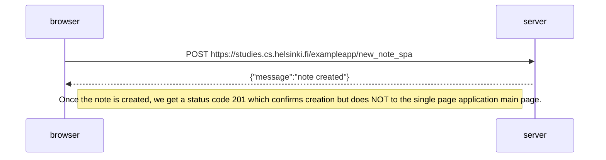

```mermaid
sequenceDiagram
    participant browser
    participant server

    browser->>server: POST https://studies.cs.helsinki.fi/exampleapp/new_note_spa
    activate server
    server-->>browser: {"message":"note created"}

    Note right of browser: Once the note is created, we get a status code 201 which confirms creation but does NOT to the single page application main page.
```
